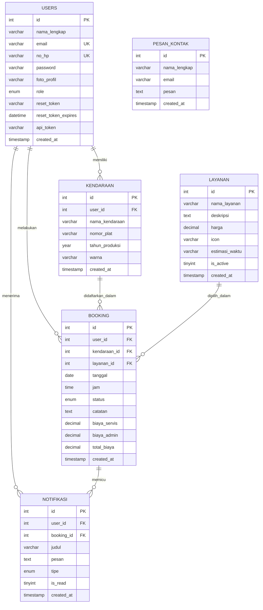

# DOKUMENTASI BACKEND & REST API - GARAGEZKA

Dokumen ini berisi spesifikasi teknis mengenai arsitektur backend, skema basis data, serta dokumentasi REST API untuk sistem **Garagezka** (Sistem Booking Servis Kendaraan). Dokumen ini disusun untuk kebutuhan dokumentasi laporan proyek.

---

## 1. Arsitektur Backend

Backend **Garagezka** dibangun menggunakan **PHP (Hypertext Preprocessor)** dengan konektivitas database MySQL/MariaDB menggunakan ekstensi **MySQLi** (Prepared Statements). 

### Karakteristik Utama Backend:
* **Stateless API:** Bagian REST API dirancang secara *stateless* menggunakan autentikasi berbasis **Bearer Token** (`api_token`).
* **CORS Enabled:** Mendukung integrasi lintas platform (Cross-Origin Resource Sharing) sehingga API dapat dikonsumsi oleh aplikasi frontend terpisah (misalnya React, Vue, Mobile App, dll.).
* **Security-First:** 
  * Pencegahan **SQL Injection** menggunakan *Prepared Statements* pada semua kueri SQL dinamis.
  * Proteksi kredensial menggunakan fungsi enkripsi **Bcrypt** (`password_hash` dan `password_verify`).
* **Response Format:** Semua respon REST API dikembalikan dalam format standard **JSON (JavaScript Object Notation)** dengan kode status HTTP yang sesuai (e.g. `200 OK`, `201 Created`, `401 Unauthorized`, `403 Forbidden`, `405 Method Not Allowed`, `500 Internal Server Error`).

---

## 2. Skema & Struktur Basis Data

Database **Garagezka** terdiri dari 6 tabel utama untuk menangani pengguna, kendaraan, jenis layanan, pesanan/booking, notifikasi, serta pesan kontak masuk.

### Entity-Relationship Diagram (ERD)



### Detail Spesifikasi Tabel

> **📸 [SCREENSHOT REKOMENDASI]**: Tempelkan screenshot relasi tabel (Designer phpMyAdmin) atau screenshot data tabel dari phpMyAdmin di sini untuk memperkuat dokumen laporan Anda.

#### 1. Tabel `users`
Tabel untuk menampung data akun pengguna (pelanggan dan administrator).

| Nama Kolom | Tipe Data | Keterangan / Constraint |
|---|---|---|
| **id** | INT | PK, Auto Increment |
| **nama_lengkap** | VARCHAR(100) | Not Null |
| **email** | VARCHAR(100) | Unique, Not Null |
| **no_hp** | VARCHAR(20) | Unique, Not Null |
| **password** | VARCHAR(255) | Not Null (Hash Bcrypt dari kata sandi) |
| **foto_profil** | VARCHAR(255) | Nullable (Path file foto profil pengguna) |
| **role** | ENUM('user', 'admin') | Default 'user' |
| **reset_token** | VARCHAR(100) | Nullable (Token untuk reset password) |
| **reset_token_expires** | DATETIME | Nullable |
| **api_token** | VARCHAR(255) | Nullable (Token autentikasi API REST) |
| **created_at** | TIMESTAMP | Default CURRENT_TIMESTAMP |
| **updated_at** | TIMESTAMP | Default CURRENT_TIMESTAMP ON UPDATE |

#### 2. Tabel `kendaraan`
Menyimpan data kendaraan yang didaftarkan oleh masing-masing user.

| Nama Kolom | Tipe Data | Keterangan / Constraint |
|---|---|---|
| **id** | INT | PK, Auto Increment |
| **user_id** | INT | FK ke `users.id` (Cascade On Delete) |
| **nama_kendaraan** | VARCHAR(100) | Not Null (Contoh: "Honda Vario 150") |
| **nomor_plat** | VARCHAR(20) | Not Null (Contoh: "B 1234 ABC") |
| **tahun_produksi** | YEAR | Not Null |
| **warna** | VARCHAR(50) | Nullable |
| **created_at** | TIMESTAMP | Default CURRENT_TIMESTAMP |

#### 3. Tabel `layanan`
Menyimpan daftar layanan servis yang tersedia di bengkel.

| Nama Kolom | Tipe Data | Keterangan / Constraint |
|---|---|---|
| **id** | INT | PK, Auto Increment |
| **nama_layanan** | VARCHAR(100) | Not Null |
| **deskripsi** | TEXT | Nullable |
| **harga** | DECIMAL(12,2) | Not Null |
| **icon** | VARCHAR(50) | Default 'wrench' |
| **estimasi_waktu** | VARCHAR(50) | Default '1-2 jam' |
| **is_active** | TINYINT(1) | Default 1 |
| **created_at** | TIMESTAMP | Default CURRENT_TIMESTAMP |

#### 4. Tabel `booking`
Menyimpan transaksi booking servis kendaraan.

| Nama Kolom | Tipe Data | Keterangan / Constraint |
|---|---|---|
| **id** | INT | PK, Auto Increment |
| **user_id** | INT | FK ke `users.id` |
| **kendaraan_id** | INT | FK ke `kendaraan.id` |
| **layanan_id** | INT | FK ke `layanan.id` |
| **tanggal** | DATE | Not Null |
| **jam** | TIME | Not Null |
| **status** | ENUM('pending', 'dikonfirmasi', 'selesai', 'dibatalkan') | Default 'pending' |
| **catatan** | TEXT | Nullable (Keluhan tambahan) |
| **biaya_servis** | DECIMAL(12,2) | Default 0 |
| **biaya_admin** | DECIMAL(12,2) | Default 10000 |
| **total_biaya** | DECIMAL(12,2) | Default 0 |
| **created_at** | TIMESTAMP | Default CURRENT_TIMESTAMP |
| **updated_at** | TIMESTAMP | Default CURRENT_TIMESTAMP ON UPDATE |

---

## 3. Spesifikasi REST API (Endpoints)

Semua endpoint API mengembalikan respon berformat JSON dan diimplementasikan di bawah direktori `/api/`.

### A. Autentikasi Pengguna
#### `POST /api/auth.php`
Mengautentikasi kredensial pengguna dan mengembalikan API Token.

* **Headers:** `Content-Type: application/json`
* **Request Body:**
  ```json
  {
    "email": "azka@email.com",
    "password": "user123"
  }
  ```
* **Response (Success - 200 OK):**
  ```json
  {
    "status": "success",
    "message": "Login berhasil",
    "token": "7a9f73f8d38cb0973a2164c4c23932be6058097b5e40e6c86a...",
    "user": {
      "id": 2,
      "nama": "Azka Gans",
      "email": "azka@email.com",
      "role": "user",
      "no_hp": "081298765432"
    }
  }
  ```
* **Response (Error - 401 Unauthorized):**
  ```json
  {
    "status": "error",
    "message": "Email atau password salah."
  }
  ```

> **📸 [SCREENSHOT PENGUJIAN API]**: Tempelkan screenshot pengujian endpoint `POST /api/auth.php` (Login) di Postman / Thunder Client di sini.

---

### B. Layanan Servis
#### `GET /api/layanan.php`
Mengambil semua daftar layanan servis yang aktif secara publik.

* **Headers:** None (Public Endpoint)
* **Response (Success - 200 OK):**
  ```json
  {
    "status": "success",
    "total": 8,
    "data": [
      {
        "id": 1,
        "nama_layanan": "Ganti Oli",
        "deskripsi": "Penggantian oli mesin dengan oli berkualitas...",
        "harga": 100000,
        "icon": "oil",
        "estimasi_waktu": "30-60 menit"
      },
      {
        "id": 2,
        "nama_layanan": "Tune Up",
        "deskripsi": "Kalibrasi yang xtrem dari segala aspek...",
        "harga": 150000,
        "icon": "tune",
        "estimasi_waktu": "1-2 jam"
      }
    ]
  }
  ```

> **📸 [SCREENSHOT PENGUJIAN API]**: Tempelkan screenshot pengujian endpoint `GET /api/layanan.php` (Melihat Layanan) di Postman / Thunder Client di sini.

---

### C. Booking Servis (Transaksi)

*Semua endpoint booking membutuhkan header autentikasi token.*

#### `GET /api/bookings.php`
Mendapatkan semua daftar riwayat booking milik pengguna yang sedang login.

* **Headers:** `Authorization: Bearer <api_token>`
* **Response (Success - 200 OK):**
  ```json
  {
    "status": "success",
    "user": "Azka Gans",
    "total": 1,
    "data": [
      {
        "id": 5,
        "tanggal": "2026-07-01",
        "jam": "09:00:00",
        "status": "pending",
        "total_biaya": 110000,
        "keluhan": "Mesin brebet",
        "nama_kendaraan": "Honda Vario 150",
        "nomor_plat": "B 1234 ABC",
        "nama_layanan": "Ganti Oli",
        "harga": 100000
      }
    ]
  }
  ```

> **📸 [SCREENSHOT PENGUJIAN API]**: Tempelkan screenshot pengujian endpoint `GET /api/bookings.php` (Daftar Booking User) di Postman / Thunder Client di sini.

#### `POST /api/bookings.php`
Membuat booking servis baru untuk pengguna yang sedang login.

* **Headers:** 
  * `Authorization: Bearer <api_token>`
  * `Content-Type: application/json`
* **Request Body:**
  ```json
  {
    "kendaraan_id": 1,
    "layanan_id": 1,
    "tanggal": "2026-07-01",
    "jam": "09:00",
    "keluhan": "Mesin brebet"
  }
  ```
* **Response (Success - 201 Created):**
  ```json
  {
    "status": "success",
    "message": "Booking berhasil dibuat.",
    "booking_id": 6,
    "data": [
      {
        "tanggal": "2026-07-01",
        "jam": "09:00",
        "total_biaya": 100000,
        "status": "pending"
      }
    ]
  }
  ```

> **📸 [SCREENSHOT PENGUJIAN API]**: Tempelkan screenshot pengujian endpoint `POST /api/bookings.php` (Membuat Booking Baru) di Postman / Thunder Client di sini.

---

### D. Manajemen Pengguna (Admin Only)
#### `GET /api/users.php`
Mengambil semua daftar pelanggan (tidak termasuk admin) beserta jumlah kendaraan & booking yang dimilikinya.

* **Headers:** `Authorization: Bearer <token_admin>`
* **Response (Success - 200 OK):**
  ```json
  {
    "status": "success",
    "total": 1,
    "data": [
      {
        "id": 2,
        "nama_lengkap": "Azka Gans",
        "email": "azka@email.com",
        "no_hp": "081298765432",
        "created_at": "2026-06-20 17:39:00",
        "total_kendaraan": 1,
        "total_booking": 1
      }
    ]
  }
  ```
* **Response (Error - 403 Forbidden):**
  ```json
  {
    "status": "error",
    "message": "Akses ditolak. Endpoint ini hanya untuk admin."
  }
  ```

> **📸 [SCREENSHOT PENGUJIAN API]**: Tempelkan screenshot pengujian endpoint `GET /api/users.php` (Daftar User - Admin Only) di Postman / Thunder Client di sini.

---

## 4. Penanganan Kode Respon & Validasi Token

Mekanisme validasi token dikontrol terpusat di `api/helpers.php`. Jika token tidak valid, kadaluarsa, atau header hilang, server secara otomatis membatalkan eksekusi kueri dan merespon dengan:

```json
{
  "status": "error",
  "message": "Token tidak valid atau sudah kadaluarsa."
}
```

Format respon kesalahan standar lainnya:
* **405 Method Not Allowed:**
  ```json
  {
    "status": "error",
    "message": "Method tidak diizinkan. Gunakan POST."
  }
  ```
* **400 Bad Request (Field kosong):**
  ```json
  {
    "status": "error",
    "message": "Email dan password wajib diisi."
  }
  ```
